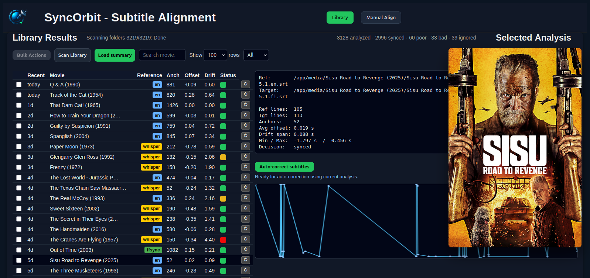

#  SyncOrbit

SyncOrbit is a self-hosted tool for analyzing, fixing, and managing subtitle synchronization in large movie libraries.

It combines automated alignment, speech-based references, and human-in-the-loop workflows to solve one problem well:

“Which subtitle is correct, and how do I make it stay that way?”



## What SyncOrbit Does

- Scans a movie library and analyzes subtitle sync quality
- Aligns subtitles using multiple reference strategies:
  - Original English subtitles
  - WhisperX-generated speech references
  - FFSubSync-aligned references
- Scores and classifies results (synced / needs adjustment / bad)
- Lets you reanalyze individual movies or run batch jobs
- Keeps state in a database (not fragile CSV glue)
- Designed for large libraries (thousands of movies)

## Design Philosophy

SyncOrbit follows a few strict principles:

- Automation first, but not blindly
- Never delete expensive work (e.g. Whisper references)
- Newest reference wins (simple, intuitive decision model)
- UI should explain decisions, not hide them
- Everything must be inspectable and reversible

It is intentionally not a media manager like Radarr or Bazarr —
SyncOrbit assumes those already exist.

🏗 Architecture Overview

```
┌────────────┐
│   Browser  │
│   (UI)     │
└─────┬──────┘
      │ REST
┌─────▼──────┐
│  SyncOrbit │
│  Node.js   │
│  API + UI  │
└─────┬──────┘
      │
      ├─ SQLite DB  (library state, decisions, timestamps)
      ├─ Python tools
      │    ├─ batch_scan.py
      │    ├─ align.py
      │    └─ ffsubsync
      │
      └─ (optional)
           WhisperX service (separate container)
```

#### Key idea

- SyncOrbit orchestrates
- Python does the heavy lifting
- WhisperX is isolated and optional

## Components

1. SyncOrbit (main container)

   - Node.js backend (API)
   - HTML / JS frontend
   - SQLite database
   - Coordinates batch jobs and single-movie actions

2. Python tools

   - batch_scan.py – full library analysis
   - align.py – subtitle alignment + statistics
   - ffsubsync – reference creation from audio

3. WhisperX service (optional)
   - Separate container
   - Exposes a simple HTTP API
   - Generates ref.srt when requested
   - Runs asynchronously (does not block UI)

If WhisperX is not running, SyncOrbit continues to work normally.

## Folder Structure (important)

```
/media
  /Movie Name (Year)
    Movie.mkv
    Movie.en.srt
    Movie.fi.srt
    folder.jpg

/app/data
  /analysis
    /Movie Name (Year)
      analysis.syncinfo
  /ref
    /Movie Name (Year)
      ref.srt
  /resync
    /Movie Name (Year)
      *.synced.srt
  ignore_list.json
  syncorbit.db
```

## Decisions & References

Each movie ends up with:

- decision

  - synced
  - needs_adjustment
  - bad

- best_reference

  - en
  - whisper
  - ffsubsync

- reference_path
- alignment statistics (anchors, drift, offsets)

#### Rule:

The newest valid reference wins — unless manually overridden.

## UI Highlights

- Fast library table (DB-backed)
- Hover poster previews (folder.jpg)
- Reference badges (EN / Whisper / FFSync)
- Inline reanalyze buttons with live feedback
- Bulk actions:
  - Ignore movies
  - Run FFSubSync
  - Touch / create Whisper references
- Analysis graphs and statistics per movie

## Batch Workflow

Typical nightly flow:

1. batch_scan.py (cron)
2. Remove missing movies from DB
3. Analyze new or changed subtitles
4. Update decisions & stats
5. UI reflects changes instantly

## How I Actually Use SyncOrbit

SyncOrbit is not something I run once and forget.

**I use it as a long-term maintenance tool for a curated movie library.**

Here is my real, day-to-day workflow.

1. Nightly batch scan (fully automatic)

   I run batch_scan.py on a schedule (cron).

   This does the heavy lifting:

   - scans the whole library
   - analyzes subtitle alignment
   - updates the database
   - removes movies that no longer exist on disk
   - skips ignored movies

   I don’t watch the output.
   I just let it run.

   SyncOrbit is designed so that nothing breaks if this takes hours.

2. Open SyncOrbit and sort by “recent”

   When I open the UI, I sort the library by Finnish subtitle modification time.

   This immediately shows:

   - new movies
   - replaced releases
   - subtitles that were recently touched

   I almost never scroll the full list — I focus on what changed.

3. Look at decisions, not files

   I don’t inspect subtitle files directly.

   Instead, I look at:

   - decision (synced, needs_adjustment, bad)
   - anchor count
   - drift span
   - reference badge (EN / Whisper / FFSubSync)

   This tells me where attention is needed without guessing.

   Most movies are fine.
   I don’t touch them.

4. Whisper only when needed

   Whisper references are expensive (slow, heavy).

   So my rule is simple:

   - If EN subtitles sync well → do nothing
   - If EN fails badly → create Whisper reference
   - Never delete Whisper references once created

   I use the bulk “Touch Whisper” action to:

   - reuse existing Whisper references
   - or request new ones in the background

   While Whisper runs, I continue using SyncOrbit normally.

5. FFSubSync as a repair tool, not default

   FFSubSync is powerful but imperfect.

   I use it when:

   - Whisper alignment still struggles
   - timing drift looks systematic
   - I need a better EN-based reference

   FFSubSync results are explicit references, not magic fixes.

   They live alongside other references and can be compared later.

6. Reanalyze single movies when something looks off

   If a movie stands out:

   - I click Reanalyze
   - SyncOrbit automatically picks the newest reference
   - Analysis updates without rerunning the whole library

   This is fast enough to use interactively.

7. Ignore movies intentionally

   Sometimes a movie is:

   - missing subtitles
   - waiting for a better release
   - intentionally excluded

   I mark it as ignored.

   Ignored movies:

   - stay in the database
   - are visible but dimmed
   - are excluded from analysis until re-enabled

   This avoids repeated “false problems”.

8. Trust the system, but verify visually

   If numbers look suspicious:

   - I open the analysis view
   - inspect offset graphs
   - confirm that subtitles feel right in playback

   SyncOrbit helps me decide where to look, not replace judgment.

### The Core Insight

Most subtitle problems don’t need fixing —
they need identification.

SyncOrbit exists to answer:

- Which subtitles are good enough?
- Which ones are worth the time?
- What changed since last time?

Once those questions are answered, the rest is easy.

## Getting Started (high level)

```
clone repo
git clone https://github.com/velinea/syncorbit
cd syncorbit

# build container
docker build -t syncorbit .

# run
docker run \
  -v /media:/media \
  -v /app/data:/app/data \
  -p 5010:5010 \
  syncorbit
```

(Exact setup depends on your environment — Unraid supported.)

## Optional: WhisperX Integration

- Run WhisperX as a separate container
- Same Docker network as SyncOrbit
- SyncOrbit calls it only when needed
- Long jobs run in the background

This avoids:

- UI blocking
- Dependency hell
- GPU coupling

## What SyncOrbit Is Not

- Not a subtitle downloader
- Not a media manager
- Not real-time
- Not cloud-based

It is a library maintenance tool.

## Project Status

- Actively used
- Architecture stabilized
- UX still evolving
- Not yet “one-click install”

Expect iteration.

## License

[MIT](https://github.com/velinea/syncorbit/blob/main/LICENSE)

## Credits & Inspiration

- FFSubSync
- Whisper / WhisperX
- Radarr / Bazarr philosophy
- Plex UX patterns
