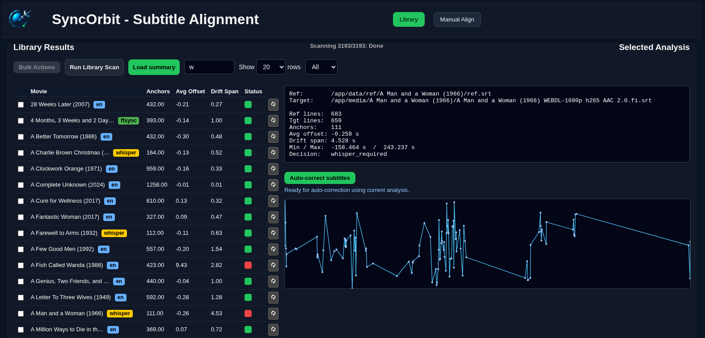

#  SyncOrbit

- SyncOrbit is a subtitle alignment, analysis, and correction tool designed for large movie libraries.
- It helps you detect subtitle drift, choose the best reference, and automatically or manually re-align subtitles using a combination of traditional methods and AI-based transcription (WhisperX).
- SyncOrbit is built for power users with curated media libraries (Radarr / Bazarr workflows), and focuses on transparency and control rather than fully automatic “black box” syncing.

## ✨ Key Features



### 📚 Library-wide subtitle analysis

- Anchor detection & drift measurement
- Per-movie sync status overview
- CSV-based summary for fast loading

### 🧠 Multiple reference strategies

- Original EN subtitles
- ffsubsync-generated references
- WhisperX-generated references
- Automatic selection of the most recent / best reference

### 📈 Visual drift analysis

- Anchor graphs with offset visualization
- Smooth toggles between raw and cleaned anchors

### 🛠️ Bulk operations

- Run ffsubsync on many movies
- Touch / manage references
- Ignore problematic titles
- Progress tracking for long-running jobs

### 🎯 Manual & per-movie re-analysis

- One-click re-analyze for individual movies
- Row-level feedback with live UI updates

### 🐳 Docker-based architecture

- Node.js backendPython alignment engine
- Clean separation of media, analysis, and generated data

### 🏗️ Architecture Overview

```
┌────────────────────────┐
│        Browser UI      │
│  (library, graphs, UI) │
└───────────▲────────────┘
            │ HTTP API
┌───────────┴────────────┐
│      Node.js API       │
│   server.cjs           │
│   bulk actions         │
│   progress tracking   │
└───────────▲────────────┘
            │ spawn
┌───────────┴────────────┐
│     Python Aligner     │
│  align.py              │
│  batch_scan.py         │
│  drift analysis        │
└───────────▲────────────┘
            │
┌───────────┴────────────┐
│    WhisperX (optional) │
│ external / remote host │
└────────────────────────┘
```

📁 Data Layout

```
/app/media            # Read-only movie library
/app/data
  ├── analysis/        # Per-movie analysis.syncinfo
  ├── ref/             # Whisper references
  ├── resync/          # ffsubsync outputs
  ├── ignore_list.json
  └── syncorbit_library_summary.csv
```

### 🚀 Getting Started

⚠️ SyncOrbit is currently power-user / self-host software.
Expect to read logs and tweak configs.

**Requirements**

- Docker / Docker Compose
- Media library mounted read-only
- Python dependencies installed inside container
- (Optional) WhisperX on a separate machine

**Basic Setup**

```
git clone https://github.com/yourname/syncorbit.git
cd syncorbit
docker build -t syncorbit .
docker run -p 5010:5010 \
  -v /path/to/movies:/app/media:ro \
  -v /path/to/data:/app/data \
  syncorbit
```

**Then open:**

http://localhost:5010

### 🧪 Workflow Philosophy

SyncOrbit is not fully automatic by design.

#### Instead:

- Analyze entire library
- Let SyncOrbit choose the best available reference
- Inspect problematic titles visually
- Apply targeted bulk fixes (ffsubsync, Whisper)
- Re-analyze individual movies as needed
- This approach scales to thousands of movies while keeping you in control.

### 🧭 Current Status

- ✅ Core alignment engine stable
- ✅ Bulk operations functional
- ✅ UI usable for daily workflows
- ⚠️ WhisperX integration assumes external setup
- ⚠️ No formal config UI yet

### 🛣️ Roadmap (Short Term)

- Better reference scoring & weighting
- Improved anchor visualization
- Configurable thresholds
- Documentation & examples
- Optional read-only demo mode

### 📜 License

[MIT](https://github.com/velinea/syncorbit/blob/main/LICENSE.md)

### 🙏 Acknowledgements

- ffsubsync
- WhisperX
- fastembed
- apidFuzz
- Radarr / Bazarr ecosystems

### 💬 Why SyncOrbit?

**Because subtitle syncing is:**

- hard to automate perfectly
- painful to debug at scale
- impossible without visibility

SyncOrbit exists to make subtitle sync observable, measurable, and fixable.
